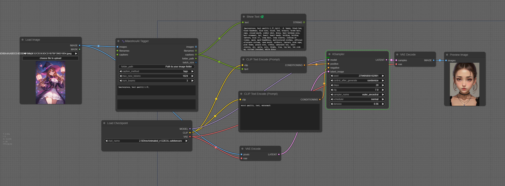
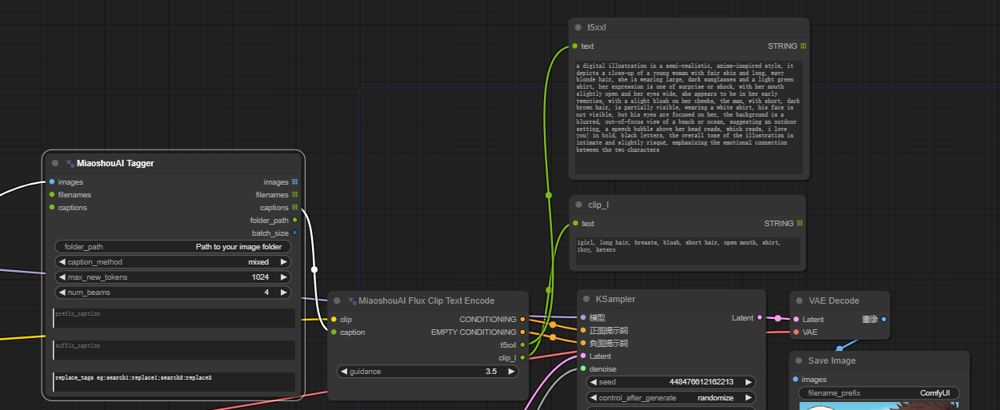

# MiaoshouAI Tagger for ComfyUI

MiaoshouAI Tagger for ComfyUI is an advanced image captioning tool based on the Microsoft Florence-2 Model Fine-tuned to perfection. This tool offers highly accurate and contextually relevant image tagging for your projects.

## Why Another Tagger?
While current taggers like WD14 perform reasonably well, they often produce errors that require manual correction. MiaoshouAI/Florence-2-base-PromptGen is fine-tuned on Microsoft's latest Florence2 model using a curated dataset from Civitai images and tags. This ensures that the tagging results are more aligned with the typical prompts used for generating images, enhancing accuracy and relevance.

## Why ComfyUI?
ComfyUI has emerged as one of the most popular node-based tools for Stable Diffusion workers. It offers various nodes and models, such as LLava and Ollama Vision nodes, for generating image captions and passing them to text encoders. However, these vision models are not specifically trained for prompting and image tagging. By using MiaoshouAI Tagger, you can see a clear improvement in results, as demonstrated in the comparison below.

## Key Features
#### High Accuracy: 
Fine-tuned on selected high quality Civitai images and clean tags to produce highly accurate and contextually relevant tags.
Node-Based System: Leverages the power of ComfyUI's node-based system to concatenate tagging nodes, combining description captioning and keyword tagging for optimal results.
#### Versatile Integration: 
Can be combined with other nodes, such as text encoding, to achieve excellent results for automatic image processing.
#### Enhanced Image Training: 
Provides the best results for image training captioning by using advanced tagging and description methods.

## Installation:

Clone this repository to 'ComfyUI/custom_nodes` folder.

Install the dependencies in requirements.txt, transformers version 4.38.0 minimum is required:

`pip install -r requirements.txt`

or if you use portable (run this in ComfyUI_windows_portable -folder):

`python_embeded\python.exe -m pip install -r ComfyUI\custom_nodes\ComfyUI-Miaoshouai-Tagger\requirements.txt`

## Workflows

Use as single image captioning

Combine simple caption with tag caption and save to output files

(Save image and grag to ComfyUI to try)

## Huggingface model
Model should be automatically downloaded the first time when you use the node. In any case that didn't happen, you can manually download it.
[MiaoshouAI/Florence-2-base-PromptGen](https://huggingface.co/MiaoshouAI/Florence-2-base-PromptGen)
The downloaded model will be placed under`ComfyUI/LLM` folder

