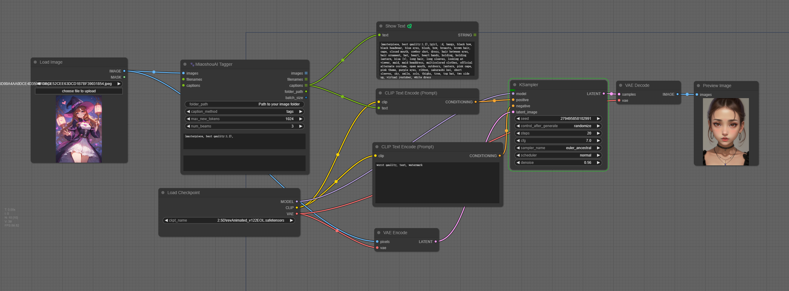
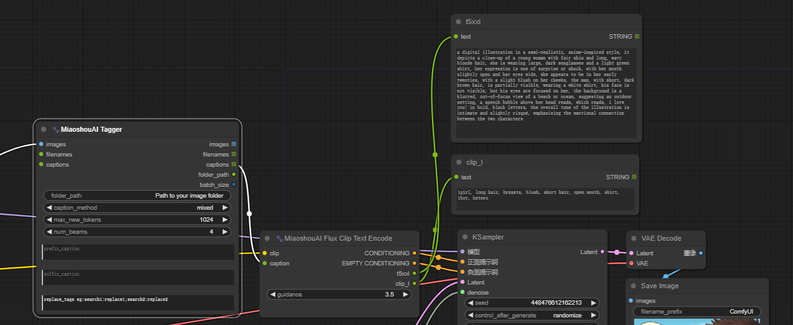

# ComfyUI用MiaoshouAI Tagger

[English](README.md) / [中文](README_CN.md) / [日本語](README_JP.md)

MiaoshouAI Tagger for ComfyUIは、MicrosoftのFlorence-2モデルに基づいた高度な画像キャプショニングツールで、完璧にファインチューニングされています。このツールは、プロジェクトに対して非常に正確で文脈に関連した画像タグ付けを提供します。

## 更新情報
2026/07/31 transformers 5.x に対応。従来はロード時に `AttributeError: 'Florence2LanguageConfig' object has no attribute 'forced_bos_token_id'` で失敗していました。これを修正した結果さらに4件の不具合が判明し、うち3件は無警告で発生するもの——エラーも警告も出ないまま、意味不明な文字列を出力する、同じ語句を延々と繰り返す、あるいはリサイズも正規化もされていない画像からキャプションを生成する、という挙動でした。詳細は[英語版の説明](README.md#transformers-5x-compatibility)を参照してください。transformers 4.x の動作は変更ありません。 
2025/12/16 transformers 4.51+ に対応（このバージョン以降 `PreTrainedModel` は `generate()` を提供しません）。Florence-2 の modeling / configuration ファイルを本リポジトリに同梱し（`modeling_florence2.py`、`configuration_florence2.py`）、`GenerationMixin` を継承するよう修正したため、`trust_remote_code` ではなくローカルからモデルを読み込みます。 
2024/11/05 v1.4 新リリースで[Florence-2-base-PromptGen-v2.0](https://huggingface.co/MiaoshouAI/Florence-2-base-PromptGen-v2.0)と[Florence-2-large-PromptGen-v2.0](https://huggingface.co/MiaoshouAI/Florence-2-large-PromptGen-v2.0)をサポート 
2024/09/28 v1.31 [この問題](https://github.com/miaoshouai/ComfyUI-Miaoshouai-Tagger/issues/15)に関連する設定エラーを修正、既存のモデルをmodels\LLMフォルダから削除し、再実行してください。新しい設定が自動的にダウンロードされます。または、[百度ドライブ](https://pan.baidu.com/s/1h8kLNmukfcUitM7mKRE89w?pwd=4xwc)フォルダからモデルをダウンロードできます。 
2024/09/07 v1.2 [Florence-2-large-PromptGen-v1.5](https://huggingface.co/MiaoshouAI/Florence-2-large-PromptGen-v1.5)をサポートするように更新、Taggerノードにランダムプロンプトウィジェットを追加し、毎回異なるプロンプトを取得したい場合は「常に」に切り替えます。 
2024/09/05 v1.1 [Florence-2-base-PromptGen-v1.5](https://huggingface.co/MiaoshouAI/Florence-2-base-PromptGen-v1.5)をサポートするように更新、2つの新しいプロンプトモードを追加；flux clipテキストエンコーダー用の新しいノードを追加し、fluxモデルクリップのサポートを簡単にします。

## なぜ別のタグ付けツールが必要なのか？
現在のWD14のようなタグ付けツールは比較的良好に機能しますが、手動での修正が必要なエラーを頻繁に生成します。MiaoshouAI/Florence-2-base-PromptGenは、Microsoftの最新のFlorence2モデルを使用し、Civitaiの画像とタグのキュレーションデータセットでファインチューニングされています。これにより、タグ付け結果が通常のプロンプトとより一致し、精度と関連性が向上します。

## なぜComfyUIなのか？
ComfyUIは、Stable Diffusionワーカーの間で最も人気のあるノードベースのツールの1つとして浮上しています。LLavaやOllama Visionノードなど、画像キャプションを生成し、テキストエンコーダーに渡すためのさまざまなノードとモデルを提供します。しかし、これらのビジョンモデルはプロンプトと画像タグ付けのために特別に訓練されていません。MiaoshouAI Taggerを使用することで、結果の明確な改善が見られます。

## 主な機能
#### 高精度：
選択された高品質のCivitai画像とクリーンなタグでファインチューニングされ、非常に正確で文脈に関連したタグを生成します。
#### ノードベースのシステム：
ComfyUIのノードベースのシステムの力を利用して、タグ付けノードを連結し、説明キャプションとキーワードタグ付けを組み合わせて最適な結果を得ることができます。
#### 多機能な統合：
他のノードと組み合わせて、テキストエンコーディングなど、優れた自動画像処理結果を達成できます。
#### 強化された画像トレーニング：
高度なタグ付けと説明方法を使用して、画像トレーニングキャプションに最適な結果を提供します。

## インストール

このリポジトリを`ComfyUI/custom_nodes`フォルダにクローンします。

`requirements.txt`の依存関係をインストールします。最低限必要なtransformersバージョンは4.38.0です：

`pip install -r requirements.txt`

または、ポータブル版を使用している場合（ComfyUI_windows_portableフォルダでこのコマンドを実行）：

`python_embeded\python.exe -m pip install -r ComfyUI\custom_nodes\ComfyUI-Miaoshouai-Tagger\requirements.txt`

## ワークフロー

単一画像キャプショニングとして使用

シンプルなキャプションとタグキャプションを組み合わせて出力ファイルに保存

（画像を保存してComfyUIにドラッグして試してください）

## Huggingfaceモデル
ノードを初めて使用する際にモデルが自動的にダウンロードされるはずです。万が一ダウンロードされなかった場合は、手動でダウンロードできます。
[MiaoshouAI/Florence-2-base-PromptGen-v1.5](https://huggingface.co/MiaoshouAI/Florence-2-base-PromptGen-v1.5)
ダウンロードされたモデルは`ComfyUI/LLM`フォルダに配置されます。
新しいバージョンのPromptGenを使用したい場合は、モデルフォルダを削除し、ComfyUIワークフローを再起動してください。モデルが自動的にダウンロードされます。

## Windowsタグ付けプログラム
ComfyUIの外でPromptGenモデルを使用して画像を一括タグ付けしたい場合は、TTPlantが作成したこのタグ付けツールを使用できます。
彼のプログラムは私のモデルを使用し、Windows環境で動作します。[ダウンロードリンク](https://github.com/TTPlanetPig/Florence_2_tagger)にアクセスしてください。
